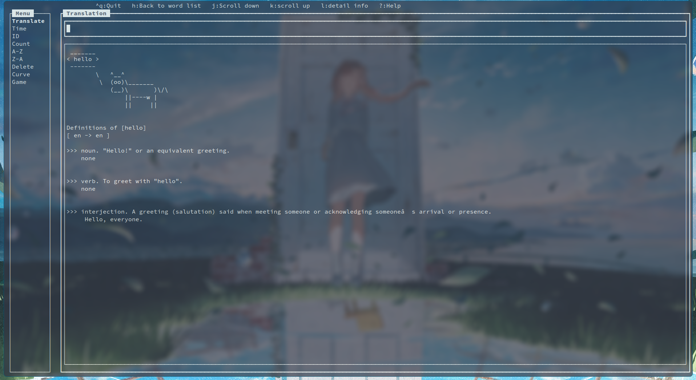

Words

It will look like:

INSTALLATION

To install this module, run the following commands:

	perl Build.PL
	./Build
	./Build test
	./Build install

You can install the dependencies by run:

    ./Build installdeps

Because it's cooperate with mysql/mariadb, you need to install and configure mysql/mariadb first.

Install and configure mariadb on Archlinux:

    sudo pacman -S mariadb cowsay
    sudo mariadb-install-db --user=mysql --basedir=/usr --datadir=/var/lib/mysql
    sudo systemctl enable mariadb
    sudo systemctl start mariadb

You need to create a user in mariadb:

    mariadb -u root -p
    CREATE USER 'username'@'host' IDENTIFIED BY 'password';

You also need to create a database and grant your user the priority:

    mariadb -u root -p
    CREATE DATABASE wordstore;
    GRANT ALL PRIVILEGES ON mydatabase.* TO 'myuser'@'localhost';
    FLUSH PRIVILEGES;

Then you can run it by:

    perl run.pl

LICENSE AND COPYRIGHT

This software is copyright (c) 2023 by Jie.

This is free software; you can redistribute it and/or modify it under
the same terms as the Perl 5 programming language system itself.

